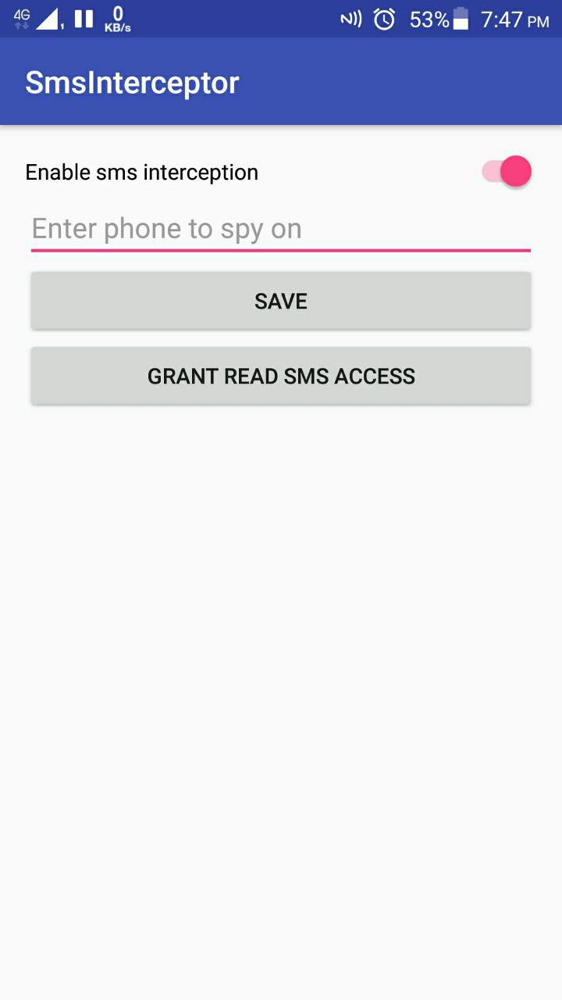

Приложение для перехвата и анализа входящих СМС
================================================
Приложение состоит из одного экрана, где можно указать номер телефона, смс от которого необходимо перехватывать.

**Как импортировать в свой проект?**

Вся логика происходит в классе SmsListener. 
Его необходимо скопировать и добавить в AndroidManifest.xml своего проекта
Также на устройствах начиная от 6.0 для чтения входящих смс необходимо получить разрешение от пользователя
на чтение смс `Manifest.permission.RECEIVE_SMS`.